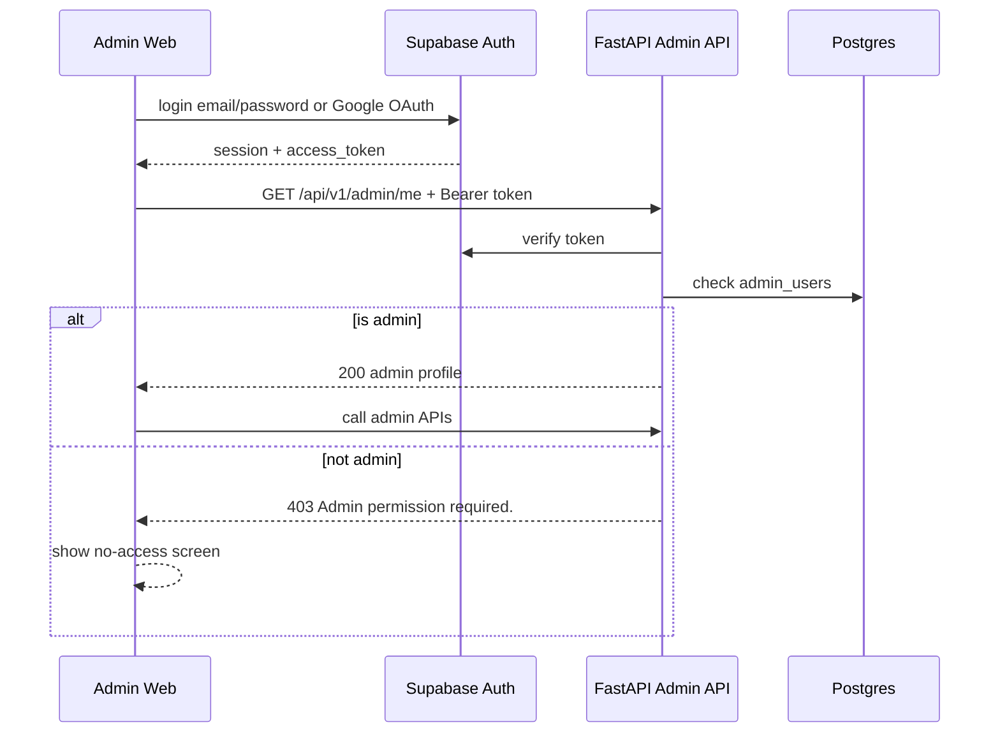

# FE Admin Phase 1 - UI/UX And API Contract

Date: 2026-06-02  
Status: **Ready for Admin FE implementation**  
Target frontend: **Next.js + TypeScript Admin Web**  
Backend base path: `/api/v1/admin`  
Backend phase: Admin Phase 1 - RBAC, dashboard, books, jobs, audit logs

---

## 1. Mục Tiêu

Admin Web là trang quản trị dành cho người vận hành hệ thống Tri Âm.

Phase 1 của Admin Web cần làm được:

- đăng nhập bằng Supabase Auth;
- kiểm tra user hiện tại có quyền admin hay không;
- xem dashboard tổng quan;
- xem danh sách người dùng đã có dữ liệu trong hệ thống;
- xem danh sách sách của tất cả user;
- xem chi tiết một sách;
- xem danh sách job xử lý;
- retry job lỗi;
- xem lịch sử thao tác admin.

Phase này chưa làm:

- upload sách hệ thống cho toàn bộ user;
- khóa user;
- xóa sách của user;
- xem log thô của server, Redis, LiveKit, Hugging Face;
- quản lý token billing thật theo provider;
- chỉnh sửa quyền admin trên UI.

---

## 2. Nguyên Tắc Bảo Mật FE Phải Tuân Thủ

Admin Web chỉ dùng:

```env
NEXT_PUBLIC_API_BASE_URL=
NEXT_PUBLIC_SUPABASE_URL=
NEXT_PUBLIC_SUPABASE_ANON_KEY=
```

Không bao giờ đưa các secret này vào FE:

- Supabase service role key;
- Redis URL/password;
- LiveKit API secret;
- OpenAI/Gemini/Google TTS API key;
- Hugging Face token;
- backend `.env`.

Luồng đúng:

```text
Admin FE
  -> Supabase login
  -> lấy access_token
  -> gọi FastAPI với Authorization Bearer
  -> BE kiểm tra token
  -> BE kiểm tra bảng admin_users
  -> BE trả dữ liệu đã lọc an toàn
```



---

## 3. Auth Flow Cho Admin Web

### 3.1 Login

Admin vẫn login bằng Supabase Auth như user app.

FE nên hỗ trợ:

- email/password;
- Google OAuth nếu project Supabase đã bật Google provider.

Sau khi login thành công, gọi ngay:

```http
GET /api/v1/admin/me
Authorization: Bearer <supabase_access_token>
```

### 3.2 Route Guard

Tất cả màn hình admin phải đi qua guard:

```text
No Supabase session -> redirect login.
Has session -> call /admin/me.
/admin/me 200 -> allow admin layout.
/admin/me 401 -> clear session and redirect login.
/admin/me 403 -> show no-access screen.
```

Không nên chỉ kiểm tra `session != null` rồi cho vào dashboard, vì user thường cũng có Supabase session nhưng không có quyền admin.

### 3.3 No Access Screen

Khi BE trả `403`:

```json
{
  "detail": "Admin permission required."
}
```

UI nên hiển thị:

```text
Tài khoản này không có quyền truy cập trang quản trị.
```

Action:

- nút đăng xuất;
- nút quay lại trang đăng nhập.

---

## 4. HTTP Client Rule

Mỗi request tới Admin API phải kèm:

```http
Authorization: Bearer <access_token>
Content-Type: application/json
```

Pseudo TypeScript:

```ts
async function adminFetch<T>(path: string, init?: RequestInit): Promise<T> {
  const { data } = await supabase.auth.getSession();
  const token = data.session?.access_token;

  if (!token) {
    throw new Error("NO_SESSION");
  }

  const res = await fetch(`${API_BASE_URL}/api/v1/admin${path}`, {
    ...init,
    headers: {
      "Content-Type": "application/json",
      Authorization: `Bearer ${token}`,
      ...(init?.headers ?? {}),
    },
  });

  if (res.status === 401) {
    throw new Error("UNAUTHORIZED");
  }

  if (res.status === 403) {
    throw new Error("ADMIN_FORBIDDEN");
  }

  const body = await res.json().catch(() => null);

  if (!res.ok) {
    throw new Error(body?.detail ?? "ADMIN_API_ERROR");
  }

  return body as T;
}
```

Best practice:

- dùng query library như TanStack Query nếu có;
- cache dashboard ngắn hạn khoảng 15-30 giây;
- invalidate jobs/books sau khi retry job;
- debounce ô search sách khoảng 300-500ms;
- không log access token ra console.

---

## 5. Layout Tổng Quan

Admin Web nên có layout desktop-first.

Gợi ý navigation:

```text
Dashboard
Users
Books
Jobs
Audit Logs
```

Header nên có:

- tên app `Tri Âm Admin`;
- email admin đang login;
- nút logout;
- trạng thái môi trường nếu có: Local / Staging / Production.

Không nên làm giao diện marketing/landing page. Đây là trang vận hành, nên UI cần:

- rõ ràng;
- dễ scan;
- bảng dữ liệu dày vừa phải;
- filter dễ thấy;
- trạng thái lỗi nổi bật;
- action nguy hiểm cần confirm.

---

## 6. Screen 1 - Admin Login

### UI Cần Có

- Logo hoặc tên `Tri Âm Admin`.
- Email/password login.
- Google login nếu đã cấu hình.
- Error message rõ:
  - sai email/password;
  - chưa có quyền admin;
  - server không kết nối được.

### Flow

```text
Submit login
-> Supabase login success
-> call GET /admin/me
-> 200: redirect Dashboard
-> 403: show no-access
-> 401: clear session
```

---

## 7. Screen 2 - Dashboard

Endpoint:

```http
GET /api/v1/admin/dashboard
```

Response:

```ts
type AdminDashboardResponse = {
  user_count: number;
  book_count: number;
  job_count: number;
  books_by_status: Record<string, number>;
  jobs_by_status: Record<string, number>;
  failed_jobs_last_24h: number;
  estimated_input_tokens_last_30d: number;
  estimated_audio_seconds_last_30d: number;
};
```

Example:

```json
{
  "user_count": 12,
  "book_count": 48,
  "job_count": 96,
  "books_by_status": {
    "draft": 4,
    "processing": 2,
    "ready": 39,
    "error": 3
  },
  "jobs_by_status": {
    "queued": 1,
    "processing": 1,
    "ready": 86,
    "error": 8
  },
  "failed_jobs_last_24h": 2,
  "estimated_input_tokens_last_30d": 1200000,
  "estimated_audio_seconds_last_30d": 36000
}
```

### UI Gợi Ý

Top metric cards:

- Users;
- Books;
- Jobs;
- Failed jobs last 24h;
- Estimated input tokens 30d;
- Estimated audio hours 30d.

Charts:

- Books by status;
- Jobs by status.

Useful CTA:

- Click `Failed jobs last 24h` -> navigate `/jobs?status=error`.
- Click `Books error` -> navigate `/books?status=error`.

### Formatting

`estimated_audio_seconds_last_30d` nên hiển thị dạng giờ:

```text
36000 seconds = 10.0 hours
```

---

## 8. Screen 3 - Users

Endpoint:

```http
GET /api/v1/admin/users?limit=50&offset=0
```

Query:

```ts
type AdminUsersQuery = {
  limit?: number;  // 1..100, default 50
  offset?: number; // >= 0, default 0
};
```

Response:

```ts
type AdminUserListItem = {
  user_id: string;
  book_count: number;
  job_count: number;
  notification_count: number;
  last_activity_at: string | null;
};

type AdminUsersResponse = {
  total: number;
  limit: number;
  offset: number;
  items: AdminUserListItem[];
};
```

### UI Gợi Ý

Table columns:

- User ID;
- Books;
- Jobs;
- Notifications;
- Last activity.

Actions:

- click user id -> filter Books by `user_id`;
- click job count -> filter Jobs by `user_id`.

Note:

Phase 1 chưa có profile name/email cho user app, vì BE chưa mirror Supabase Auth users vào bảng riêng. FE đừng tự gọi Supabase Admin API để lấy danh sách user.

---

## 9. Screen 4 - Books

Endpoint:

```http
GET /api/v1/admin/books
```

Query:

```ts
type AdminBooksQuery = {
  limit?: number;          // 1..100
  offset?: number;         // >= 0
  status?: BookStatus;
  document_type?: DocumentType;
  user_id?: string;
  q?: string;              // title search, 1..120 chars
};

type BookStatus =
  | "draft"
  | "processing"
  | "partial_ready"
  | "ready"
  | "error";

type DocumentType = "pdf" | "epub" | "docx";
```

Response:

```ts
type AdminBookListItem = {
  id: string;
  user_id: string;
  title: string;
  author: string | null;
  document_type: string | null;
  status: string | null;
  total_sections: number | null;
  total_units: number | null;
  error_message: string | null;
  created_at: string;
  updated_at: string;
};

type AdminBooksResponse = {
  total: number;
  limit: number;
  offset: number;
  items: AdminBookListItem[];
};
```

### UI Gợi Ý

Filter bar:

- search title;
- status select;
- document type select;
- user id input;
- reset filters.

Table columns:

- Title;
- User ID;
- Type;
- Status;
- Sections;
- Units;
- Updated;
- Error.

Status badge:

```text
draft         = xám
processing    = xanh dương
partial_ready = tím hoặc xanh cyan
ready         = xanh lá
error         = đỏ
```

Row action:

- View detail.
- Nếu status `error`, có thể link sang Jobs filter theo `book_id`.

Security:

- Response không có `file_url`;
- không có raw text;
- không có audio signed URL;
- FE không cần tự fetch storage object.

---

## 10. Screen 5 - Book Detail

Endpoint:

```http
GET /api/v1/admin/books/{book_id}
```

Response:

```ts
type AdminBookDetailResponse = AdminBookListItem & {
  latest_job: AdminJobListItem | null;
  learning_units_by_status: Record<string, number>;
  segment_count: number;
};
```

### UI Gợi Ý

Sections:

1. Book metadata
   - title;
   - author;
   - user id;
   - document type;
   - status;
   - created/updated.

2. Processing summary
   - total sections;
   - total units;
   - segment count;
   - learning units by status.

3. Latest job
   - job id;
   - job type;
   - mode;
   - progress;
   - current step;
   - error message;
   - retry action if allowed.

Allowed retry button condition:

```ts
const canRetry =
  latestJob &&
  ["error", "cancelled"].includes(latestJob.status) &&
  ["generate_plan", "switch_mode"].includes(latestJob.job_type);
```

Nếu không thể retry, FE nên disable button và giải thích ngắn:

```text
Chỉ job lỗi hoặc đã hủy mới có thể chạy lại.
```

---

## 11. Screen 6 - Jobs

Endpoint:

```http
GET /api/v1/admin/jobs
```

Query:

```ts
type AdminJobsQuery = {
  limit?: number;
  offset?: number;
  status?: ProcessingJobStatus;
  job_type?: ProcessingJobType;
  user_id?: string;
  book_id?: string;
};

type ProcessingJobStatus =
  | "queued"
  | "processing"
  | "partial_ready"
  | "ready"
  | "error"
  | "cancelled";

type ProcessingJobType =
  | "upload"
  | "generate_plan"
  | "switch_mode"
  | "notification"
  | "review";
```

Response:

```ts
type AdminJobListItem = {
  id: string;
  user_id: string;
  book_id: string | null;
  job_type: ProcessingJobType;
  status: ProcessingJobStatus;
  mode: "full" | "pareto" | null;
  progress_percent: number;
  current_step: string | null;
  total_units: number;
  done_units: number;
  failed_units: number;
  estimated_input_tokens: number | null;
  estimated_audio_seconds: number | null;
  error_message: string | null;
  created_at: string;
  updated_at: string;
  started_at: string | null;
  finished_at: string | null;
};

type AdminJobsResponse = {
  total: number;
  limit: number;
  offset: number;
  items: AdminJobListItem[];
};
```

### UI Gợi Ý

Filter bar:

- status;
- job type;
- user id;
- book id;
- reset.

Table columns:

- Job ID;
- Type;
- Status;
- Mode;
- Progress;
- Units;
- Book ID;
- User ID;
- Updated;
- Error.

Progress display:

```text
progress_percent%
done_units / total_units
failed_units if > 0
```

Row action:

- View related book;
- Retry if allowed.

---

## 12. Retry Job

Endpoint:

```http
POST /api/v1/admin/jobs/{job_id}/retry
```

No request body.

Response:

```ts
type AdminRetryJobResponse = {
  job: AdminJobListItem;
  message: string;
};
```

Example:

```json
{
  "job": {
    "id": "uuid",
    "user_id": "uuid",
    "book_id": "uuid",
    "job_type": "generate_plan",
    "status": "queued",
    "mode": "pareto",
    "progress_percent": 0,
    "current_step": "Admin đã đưa job vào hàng đợi xử lý lại.",
    "total_units": 3,
    "done_units": 0,
    "failed_units": 0,
    "estimated_input_tokens": null,
    "estimated_audio_seconds": null,
    "error_message": null,
    "created_at": "2026-06-02T05:00:00Z",
    "updated_at": "2026-06-02T05:30:00Z",
    "started_at": null,
    "finished_at": null
  },
  "message": "Job đã được đưa vào hàng đợi xử lý lại."
}
```

### UX Rule

Retry là thao tác vận hành quan trọng, FE phải confirm:

```text
Bạn có chắc muốn chạy lại job này không?
```

Sau khi retry thành công:

- show toast success;
- invalidate jobs query;
- invalidate book detail query nếu đang ở book detail;
- link sang job vừa retry.

### Error Cases

`409`:

```json
{
  "detail": "Job không ở trạng thái có thể retry."
}
```

`400`:

```json
{
  "detail": "Job này không hỗ trợ retry từ admin."
}
```

`502`:

```json
{
  "detail": "Không thể đưa job vào hàng đợi retry."
}
```

FE nên hiển thị lỗi BE trả về, không thay bằng lỗi chung vô nghĩa.

---

## 13. Screen 7 - Audit Logs

Endpoint:

```http
GET /api/v1/admin/audit-logs
```

Query:

```ts
type AdminAuditLogsQuery = {
  limit?: number;
  offset?: number;
  action?: string;
  admin_user_id?: string;
};
```

Response:

```ts
type AdminAuditLogItem = {
  id: string;
  admin_user_id: string;
  action: string;
  target_type: string | null;
  target_id: string | null;
  metadata: Record<string, unknown> | null;
  created_at: string;
};

type AdminAuditLogsResponse = {
  total: number;
  limit: number;
  offset: number;
  items: AdminAuditLogItem[];
};
```

### UI Gợi Ý

Table columns:

- Time;
- Admin user;
- Action;
- Target type;
- Target id;
- Metadata.

Metadata nên render dạng collapsible JSON, không bung toàn bộ nếu quá dài.

Phase 1 action quan trọng:

```text
job.retry
job.retry_enqueue_failed
```

---

## 14. Pagination

Tất cả list endpoint dùng:

```text
limit: 1..100
offset: >= 0
```

FE có thể implement:

```ts
const nextOffset = offset + limit;
const prevOffset = Math.max(0, offset - limit);
const hasNext = offset + items.length < total;
const hasPrev = offset > 0;
```

UI pagination tối thiểu:

- Previous;
- Next;
- `Showing x-y of total`.

Không request `limit > 100`, BE sẽ trả 422.

---

## 15. Empty, Loading, Error States

Mỗi screen cần đủ 3 trạng thái:

### Loading

```text
Đang tải dữ liệu...
```

Nên dùng skeleton table hoặc spinner nhỏ.

### Empty

Ví dụ Books:

```text
Chưa có sách nào khớp với bộ lọc.
```

### Error

Hiển thị `detail` BE trả về.

Common mapping:

```text
401 -> Phiên đăng nhập đã hết hạn. Vui lòng đăng nhập lại.
403 -> Tài khoản này không có quyền truy cập trang quản trị.
422 -> Bộ lọc không hợp lệ.
500/502 -> Hệ thống đang gặp lỗi. Vui lòng thử lại sau.
```

---

## 16. UI/UX Quality Bar

Admin UI là công cụ vận hành, nên ưu tiên:

- rõ ràng hơn đẹp màu mè;
- bảng dữ liệu có filter và sort visual rõ;
- status badge dễ nhận diện;
- action retry cần confirm;
- lỗi phải hiển thị nguyên nhân;
- timestamp nên format theo timezone local;
- ID dài nên có copy button;
- không reload nguyên trang sau mỗi action nếu có thể invalidate data.

Gợi ý format ID:

```text
195d9623...2471
```

Nhưng copy button phải copy full UUID.

---

## 17. Suggested Admin Routes

FE có thể đặt route như sau, không bắt buộc theo folder structure:

```text
/login
/no-access
/dashboard
/users
/books
/books/:bookId
/jobs
/audit-logs
```

Default after login:

```text
/dashboard
```

Deep link examples:

```text
/books?status=error
/books?user_id=<uuid>
/jobs?status=error
/jobs?book_id=<uuid>
/audit-logs?action=job.retry
```

---

## 18. TypeScript Types Tổng Hợp

```ts
export type BookStatus =
  | "draft"
  | "processing"
  | "partial_ready"
  | "ready"
  | "error";

export type DocumentType = "pdf" | "epub" | "docx";

export type PlanMode = "full" | "pareto";

export type ProcessingJobStatus =
  | "queued"
  | "processing"
  | "partial_ready"
  | "ready"
  | "error"
  | "cancelled";

export type ProcessingJobType =
  | "upload"
  | "generate_plan"
  | "switch_mode"
  | "notification"
  | "review";

export type AdminMeResponse = {
  user_id: string;
  email: string | null;
  role: string;
  is_active: boolean;
};

export type AdminDashboardResponse = {
  user_count: number;
  book_count: number;
  job_count: number;
  books_by_status: Record<string, number>;
  jobs_by_status: Record<string, number>;
  failed_jobs_last_24h: number;
  estimated_input_tokens_last_30d: number;
  estimated_audio_seconds_last_30d: number;
};

export type AdminUserListItem = {
  user_id: string;
  book_count: number;
  job_count: number;
  notification_count: number;
  last_activity_at: string | null;
};

export type AdminBookListItem = {
  id: string;
  user_id: string;
  title: string;
  author: string | null;
  document_type: string | null;
  status: string | null;
  total_sections: number | null;
  total_units: number | null;
  error_message: string | null;
  created_at: string;
  updated_at: string;
};

export type AdminJobListItem = {
  id: string;
  user_id: string;
  book_id: string | null;
  job_type: ProcessingJobType;
  status: ProcessingJobStatus;
  mode: PlanMode | null;
  progress_percent: number;
  current_step: string | null;
  total_units: number;
  done_units: number;
  failed_units: number;
  estimated_input_tokens: number | null;
  estimated_audio_seconds: number | null;
  error_message: string | null;
  created_at: string;
  updated_at: string;
  started_at: string | null;
  finished_at: string | null;
};

export type AdminBookDetailResponse = AdminBookListItem & {
  latest_job: AdminJobListItem | null;
  learning_units_by_status: Record<string, number>;
  segment_count: number;
};

export type AdminAuditLogItem = {
  id: string;
  admin_user_id: string;
  action: string;
  target_type: string | null;
  target_id: string | null;
  metadata: Record<string, unknown> | null;
  created_at: string;
};

export type PaginatedResponse<T> = {
  total: number;
  limit: number;
  offset: number;
  items: T[];
};
```

---

## 19. Manual Test Checklist Cho FE

### Auth

- [ ] User chưa login vào `/dashboard` bị chuyển về login.
- [ ] User thường login xong bị chặn ở no-access.
- [ ] Admin login xong vào dashboard được.
- [ ] Logout xóa session và về login.

### Dashboard

- [ ] Metric cards render đúng.
- [ ] Click failed jobs dẫn tới Jobs filter `status=error`.
- [ ] Loading/empty/error state hoạt động.

### Books

- [ ] List sách load được.
- [ ] Filter status hoạt động.
- [ ] Filter document type hoạt động.
- [ ] Search title debounce.
- [ ] Click book mở detail.
- [ ] Sách lỗi hiển thị error message dễ đọc.

### Jobs

- [ ] List jobs load được.
- [ ] Filter status/job type/user/book hoạt động.
- [ ] Job lỗi có nút retry.
- [ ] Job processing/ready không cho retry.
- [ ] Retry success refresh lại list.
- [ ] Retry fail hiển thị lỗi BE.

### Audit Logs

- [ ] Retry job tạo audit log `job.retry`.
- [ ] Filter action hoạt động.
- [ ] Metadata JSON không làm vỡ layout.

---

## 20. Known Limits Của Phase 1

Các giới hạn này là chủ động, không phải bug:

1. Users screen chưa có email/name của user app.
   - Lý do: BE chưa mirror Supabase Auth users vào bảng app users.

2. Admin chưa xem raw server logs.
   - Lý do: log thô có thể chứa thông tin nhạy cảm nếu hệ thống cấu hình sai.

3. Admin chưa upload sách hệ thống.
   - Lý do: cần Phase Admin 2 thiết kế `system_public` book ingest/publish flow.

4. Admin chưa khóa user hoặc xóa sách user.
   - Lý do: đây là thao tác nguy hiểm, cần audit/confirm/permission rõ hơn.

5. Cost dashboard chỉ là estimate từ DB job.
   - Lý do: chưa tích hợp billing API thật của provider.

---

## 21. BE Contract Stability

FE có thể bắt đầu implement với các endpoint Phase 1 này:

```text
GET  /api/v1/admin/me
GET  /api/v1/admin/dashboard
GET  /api/v1/admin/users
GET  /api/v1/admin/books
GET  /api/v1/admin/books/{book_id}
GET  /api/v1/admin/jobs
POST /api/v1/admin/jobs/{job_id}/retry
GET  /api/v1/admin/audit-logs
```

Nếu Phase Admin 2 thêm system book ingest, BE sẽ tạo document contract mới riêng để tránh trộn với Phase 1.
