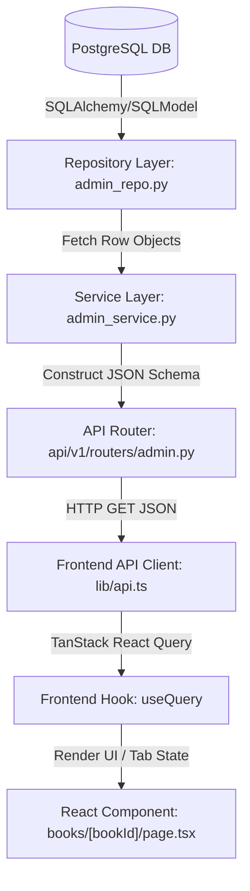

# Hướng dẫn chi tiết triển khai Phase 3 - Nâng cấp Chi tiết Sách (Enhanced Book Detail)

Tài liệu này hướng dẫn chi tiết từng bước (Step-by-step) cách thiết lập cấu trúc mã nguồn, viết mã cho cả **Backend (FastAPI)** và **Frontend (Next.js)** để hoàn thành Phase 3: Nâng cấp trang Chi tiết Sách.

Giao diện chi tiết sách sẽ được thiết kế lại thành một **Dashboard 3 Tab cao cấp** theo phong cách **Glassmorphism Dark Theme**, tích hợp khả năng tải dữ liệu theo yêu cầu (on-demand loading) để tối ưu hóa hiệu năng truyền tải mạng.

---

## 1. Kiến trúc luồng hoạt động (Data Flow & Architecture)

Để dễ hình dung cho các bạn fresher, dưới đây là sơ đồ di chuyển của dữ liệu từ cơ sở dữ liệu lên đến giao diện trình duyệt:



### Chiến lược Tải theo yêu cầu (On-demand Loading)
Sách nói có thể rất lớn (hàng triệu ký tự văn bản thô và hàng ngàn vector chunk). Nếu tải toàn bộ ở một API duy nhất `/books/{book_id}`, trình duyệt sẽ bị đơ và mạng bị nghẽn. 
* **Giải pháp**: Tách thông tin thành nhiều cổng API phụ.
  1. Khi vào trang $\rightarrow$ Gọi API `/books/{book_id}` để lấy thông tin tổng quan, thông tin người dùng sở hữu sách (`owner_info`) và `/books/{book_id}/sections` để hiển thị **cây thư mục trống**.
  2. Chỉ khi Admin **click chọn** vào một chương cụ thể trên cây thư mục $\rightarrow$ Gọi API `/books/{book_id}/sections/{section_id}` để tải văn bản thô (`text_content`) và danh sách các chunk nhúng (`chunks`) của duy nhất chương đó.
  3. Khi Admin chuyển sang Tab Lịch sử $\rightarrow$ Gọi API `/books/{book_id}/jobs` để lấy danh sách tiến trình.

---

## 2. Các bước triển khai Backend (FastAPI)

### Bước 2.1: Cấu hình Schemas Dữ liệu
**File cần sửa đổi**: [app/schemas/admin.py](file:///w:/WorkSpace_IT/_CAPSTON_PROJECT/triam-backend/app/schemas/admin.py)

Thêm các lớp Pydantic (Schema) mới vào cuối file để định nghĩa cấu trúc dữ liệu JSON trả về cho Client.

```python
# Thêm các lớp này vào cuối file app/schemas/admin.py

class AdminBookOwnerInfo(BaseModel):
    user_id: uuid.UUID
    email: str | None = None
    display_name: str | None = None
    avatar_url: str | None = None
    account_created_at: datetime | None = None
    last_sign_in_at: datetime | None = None

class AdminBookSectionListItem(BaseModel):
    id: uuid.UUID
    section_index: int
    title: str
    level: int
    path: str
    text_char_count: int
    page_start: int | None = None
    page_end: int | None = None
    chunk_count: int = 0
    has_text: bool = False

class AdminSectionChunkItem(BaseModel):
    id: int
    chunk_index: int
    content: str
    search_text: str
    embedding_model: str
    embedding_version: str
    char_count: int
    token_count: int | None = None
    has_embedding: bool = False

class AdminBookSectionDetailResponse(BaseModel):
    id: uuid.UUID
    section_index: int
    title: str
    level: int
    path: str
    text_content: str | None = None
    text_char_count: int
    page_start: int | None = None
    page_end: int | None = None
    chunks: list[AdminSectionChunkItem] = []

# Cập nhật lại lớp AdminBookDetailResponse hiện tại để bổ sung owner_info:
class AdminBookDetailResponse(AdminBookListItem):
    latest_job: AdminJobListItem | None = None
    learning_units_by_status: dict[str, int] = Field(default_factory=dict)
    segment_count: int = 0
    owner_info: AdminBookOwnerInfo | None = None  # <-- THÊM DÒNG NÀY
```

---

### Bước 2.2: Viết logic xử lý ở Service Layer
**File cần sửa đổi**: [app/services/admin_service.py](file:///w:/WorkSpace_IT/_CAPSTON_PROJECT/triam-backend/app/services/admin_service.py)

#### 1. Cập nhật hàm `get_book_detail` hiện tại:
Tìm hàm `get_book_detail` và chỉnh sửa để lấy thêm thông tin của User sở hữu cuốn sách đó:

```python
# Sửa lại hàm get_book_detail trong app/services/admin_service.py:

def get_book_detail(session: Session, book_id: uuid.UUID) -> AdminBookDetailResponse:
    book = get_admin_book_by_id(session, book_id)
    if not book:
        raise BookNotFoundError()

    latest_job = get_latest_admin_job_for_book(session, book_id)
    
    # Query các chế độ học hiện tại của sách
    rows = session.exec(
        select(LearningUnit.mode)
        .where(LearningUnit.book_id == book_id)
        .group_by(LearningUnit.mode)
    ).all()
    book_modes = {mode.value for mode in rows}

    # THÊM LOGIC LẤY THÔNG TIN CHỦ SỞ HỮU SÁCH:
    owner_info = None
    if book.user_id:
        from app.repositories.admin_repo import auth_users
        user_row = session.exec(
            select(auth_users.c.id, auth_users.c.email, auth_users.c.created_at, auth_users.c.last_sign_in_at, auth_users.c.raw_user_meta_data)
            .where(auth_users.c.id == book.user_id)
        ).first()
        if user_row:
            u_id, email, c_at, l_in, meta = user_row
            meta_dict = meta if isinstance(meta, dict) else {}
            owner_info = AdminBookOwnerInfo(
                user_id=u_id,
                email=email,
                display_name=meta_dict.get("name") or meta_dict.get("full_name"),
                avatar_url=meta_dict.get("avatar_url") or meta_dict.get("picture"),
                account_created_at=c_at,
                last_sign_in_at=l_in
            )

    return AdminBookDetailResponse(
        id=book.id,
        user_id=book.user_id,
        title=book.title,
        author=book.author,
        document_type=book.document_type,
        status=book.status,
        total_sections=book.total_sections,
        total_units=book.total_units,
        error_message=book.error_message,
        is_shared=book.is_shared,
        parent_shared_id=book.parent_shared_id,
        has_full_mode="full" in book_modes,
        has_pareto_mode="pareto" in book_modes,
        created_at=book.created_at,
        updated_at=book.updated_at,
        latest_job=AdminJobListItem.model_validate(latest_job) if latest_job else None,
        learning_units_by_status=count_learning_units_by_status(session, book_id),
        segment_count=count_learning_unit_segments_for_book(session, book_id),
        owner_info=owner_info,  # <-- GÁN THÔNG TIN VÀO SCHEMA TRẢ VỀ
    )
```

#### 2. Thêm các hàm nghiệp vụ mới vào cuối file `app/services/admin_service.py`:

```python
# Thêm vào cuối file app/services/admin_service.py

def get_book_sections(session: Session, book_id: uuid.UUID) -> list[AdminBookSectionListItem]:
    # Lấy toàn bộ các section của sách, xếp theo thứ tự mục lục (section_index)
    sections = session.exec(
        select(BookSection)
        .where(BookSection.book_id == book_id)
        .order_by(BookSection.section_index.asc())
    ).all()
    
    # Tính số lượng chunk đã nhúng của từng section để hiển thị ở cây mục lục
    chunks_count_map = {}
    if sections:
        chunk_counts = session.exec(
            select(BookSectionKnowledge.section_id, func.count(BookSectionKnowledge.id))
            .where(BookSectionKnowledge.book_id == book_id)
            .group_by(BookSectionKnowledge.section_id)
        ).all()
        chunks_count_map = {s_id: count for s_id, count in chunk_counts}

    return [
        AdminBookSectionListItem(
            id=s.id,
            section_index=s.section_index,
            title=s.title,
            level=s.level,
            path=s.path,
            text_char_count=s.text_char_count,
            page_start=s.page_start,
            page_end=s.page_end,
            chunk_count=chunks_count_map.get(s.id, 0),
            has_text=bool(s.text_content and s.text_content.strip())
        )
        for s in sections
    ]

def get_book_section_detail(session: Session, book_id: uuid.UUID, section_id: uuid.UUID) -> AdminBookSectionDetailResponse:
    # Lấy thông tin section
    section = session.exec(
        select(BookSection)
        .where(BookSection.book_id == book_id, BookSection.id == section_id)
    ).first()
    
    if not section:
        raise HTTPException(status_code=404, detail="Không tìm thấy mục lục sách.")

    # Lấy các chunk kiến thức (vector embeddings) liên quan
    chunks = session.exec(
        select(BookSectionKnowledge)
        .where(BookSectionKnowledge.section_id == section_id)
        .order_by(BookSectionKnowledge.chunk_index.asc())
    ).all()

    chunk_items = [
        AdminSectionChunkItem(
            id=c.id,
            chunk_index=c.chunk_index,
            content=c.content,
            search_text=c.search_text,
            embedding_model=c.embedding_model,
            embedding_version=c.embedding_version,
            char_count=c.char_count,
            token_count=c.token_count,
            has_embedding=c.embedding is not None
        )
        for c in chunks
    ]

    return AdminBookSectionDetailResponse(
        id=section.id,
        section_index=section.section_index,
        title=section.title,
        level=section.level,
        path=section.path,
        text_content=section.text_content,
        text_char_count=section.text_char_count,
        page_start=section.page_start,
        page_end=section.page_end,
        chunks=chunk_items
    )

def get_book_jobs(session: Session, book_id: uuid.UUID) -> list[AdminJobListItem]:
    # Truy vấn toàn bộ danh sách jobs chạy của cuốn sách này
    jobs = session.exec(
        select(ProcessingJob)
        .where(ProcessingJob.book_id == book_id)
        .order_by(ProcessingJob.created_at.desc())
    ).all()
    
    return [AdminJobListItem.model_validate(j) for j in jobs]
```

---

### Bước 2.3: Đăng ký API Routers
**File cần sửa đổi**: [app/api/v1/routers/admin.py](file:///w:/WorkSpace_IT/_CAPSTON_PROJECT/triam-backend/app/api/v1/routers/admin.py)

Bổ sung 3 routers mới để cung cấp cổng API cho Frontend gọi. Chú ý đặt phía dưới router chi tiết sách cũ `/books/{book_id}`.

```python
# Thêm các routers này vào file app/api/v1/routers/admin.py

@router.get("/books/{book_id}/sections", response_model=list[AdminBookSectionListItem])
def read_admin_book_sections(
    book_id: uuid.UUID,
    admin_user: AdminUserDependency,
    session: Annotated[Session, Depends(get_session)],
):
    return admin_service.get_book_sections(session, book_id)


@router.get("/books/{book_id}/sections/{section_id}", response_model=AdminBookSectionDetailResponse)
def read_admin_book_section_detail(
    book_id: uuid.UUID,
    section_id: uuid.UUID,
    admin_user: AdminUserDependency,
    session: Annotated[Session, Depends(get_session)],
):
    return admin_service.get_book_section_detail(session, book_id, section_id)


@router.get("/books/{book_id}/jobs", response_model=list[AdminJobListItem])
def read_admin_book_jobs(
    book_id: uuid.UUID,
    admin_user: AdminUserDependency,
    session: Annotated[Session, Depends(get_session)],
):
    return admin_service.get_book_jobs(session, book_id)
```

---

## 3. Các bước triển khai Frontend (Next.js)

### Bước 3.1: Định nghĩa Types và Fetching APIs
**File cần sửa đổi**: [lib/api.ts](file:///w:/WorkSpace_IT/_CAPSTON_PROJECT/triam-admin-web/lib/api.ts)

#### 1. Định nghĩa các kiểu dữ liệu khớp với Backend:
```typescript
// Thêm vào file lib/api.ts các Types sau:

export type AdminBookOwnerInfo = {
  user_id: string;
  email: string | null;
  display_name: string | null;
  avatar_url: string | null;
  account_created_at: string | null;
  last_sign_in_at: string | null;
};

export type AdminBookSectionListItem = {
  id: string;
  section_index: number;
  title: string;
  level: number;
  path: string;
  text_char_count: number;
  page_start: number | null;
  page_end: number | null;
  chunk_count: number;
  has_text: boolean;
};

export type AdminSectionChunkItem = {
  id: number;
  chunk_index: number;
  content: string;
  search_text: string;
  embedding_model: string;
  embedding_version: string;
  char_count: number;
  token_count: number | null;
  has_embedding: boolean;
};

export type AdminBookSectionDetailResponse = {
  id: string;
  section_index: number;
  title: string;
  level: number;
  path: string;
  text_content: string | null;
  text_char_count: number;
  page_start: number | null;
  page_end: number | null;
  chunks: AdminSectionChunkItem[];
};

// Cập nhật lại kiểu AdminBookDetailResponse hiện tại:
export type AdminBookDetailResponse = AdminBookListItem & {
  latest_job: AdminJobListItem | null;
  learning_units_by_status: Record<string, number>;
  segment_count: number;
  owner_info?: AdminBookOwnerInfo | null; // <-- THÊM DÒNG NÀY
};
```

#### 2. Viết thêm 3 hàm fetch gọi dữ liệu từ API:
```typescript
// Thêm 3 hàm này vào cuối file lib/api.ts:

export async function getBookSections(bookId: string): Promise<AdminBookSectionListItem[]> {
  return adminFetch<AdminBookSectionListItem[]>(`/books/${bookId}/sections`);
}

export async function getBookSectionDetail(
  bookId: string,
  sectionId: string
): Promise<AdminBookSectionDetailResponse> {
  return adminFetch<AdminBookSectionDetailResponse>(`/books/${bookId}/sections/${sectionId}`);
}

export async function getBookJobs(bookId: string): Promise<AdminJobListItem[]> {
  return adminFetch<AdminJobListItem[]>(`/books/${bookId}/jobs`);
}
```

---

### Bước 3.2: Tái cấu trúc trang Chi tiết Sách (Redesign UI/UX)
**File cần sửa đổi**: [app/(admin)/books/[bookId]/page.tsx](file:///w:/WorkSpace_IT/_CAPSTON_PROJECT/triam-admin-web/app/%28admin%29/books/%5BbookId%5D/page.tsx)

Chúng ta sẽ viết lại file này bằng cách phân chia giao diện thành 3 Tab lớn:
1. **Tổng quan (Overview)**
2. **Cấu trúc & Vector Chunks (Sections)**
3. **Lịch sử hoạt động (Jobs History)**

Mã nguồn mới của file [books/[bookId]/page.tsx](file:///w:/WorkSpace_IT/_CAPSTON_PROJECT/triam-admin-web/app/%28admin%29/books/%5BbookId%5D/page.tsx) như sau:

```tsx
"use client";

import React, { useState } from "react";
import { useParams, useRouter } from "next/navigation";
import { useQuery, useMutation, useQueryClient } from "@tanstack/react-query";
import { 
  adminFetch, 
  AdminBookDetailResponse, 
  getErrorMessage, 
  getBookSections, 
  getBookSectionDetail, 
  getBookJobs,
  AdminBookSectionListItem,
  AdminJobListItem
} from "@/lib/api";
import { formatDate, formatDateShort, truncateId, getInitials } from "@/lib/utils";
import {
  ArrowLeft,
  BookOpen,
  Calendar,
  FileCode,
  Info,
  Cpu,
  RefreshCw,
  AlertTriangle,
  Play,
  Copy,
  Clock,
  Coins,
  History,
  LayoutGrid,
  ChevronRight,
  Database,
  FileText,
  User,
  ShieldAlert,
} from "lucide-react";
import { toast } from "sonner";

export default function BookDetailPage() {
  const params = useParams();
  const router = useRouter();
  const queryClient = useQueryClient();
  const bookId = params.bookId as string;

  // Quản lý Tab hoạt động ('overview' | 'sections' | 'jobs')
  const [activeTab, setActiveTab] = useState<"overview" | "sections" | "jobs">("overview");

  // ID Section hiện tại đang được chọn ở Tab 2
  const [selectedSectionId, setSelectedSectionId] = useState<string | null>(null);

  // Quản lý trạng thái hộp thoại xác nhận Retry Job
  const [showConfirmModal, setShowConfirmModal] = useState(false);
  const [retryJobId, setRetryJobId] = useState<string | null>(null);

  // Query 1: Lấy thông tin tổng quan của Sách
  const {
    data: book,
    isLoading: isBookLoading,
    isError: isBookError,
    error,
    refetch: refetchBook,
    isRefetching: isBookRefetching,
  } = useQuery<AdminBookDetailResponse>({
    queryKey: ["adminBookDetail", bookId],
    queryFn: () => adminFetch<AdminBookDetailResponse>(`/books/${bookId}`),
  });

  // Query 2: Lấy mục lục cây chương mục (Chỉ chạy khi vào Tab 'sections')
  const {
    data: sections = [],
    isLoading: isSectionsLoading,
    refetch: refetchSections,
  } = useQuery<AdminBookSectionListItem[]>({
    queryKey: ["adminBookSections", bookId],
    queryFn: () => getBookSections(bookId),
    enabled: activeTab === "sections",
  });

  // Query 3: Chi tiết nội dung của Section được click chọn (Chỉ chạy khi có ID)
  const {
    data: sectionDetail,
    isLoading: isSectionDetailLoading,
  } = useQuery({
    queryKey: ["adminBookSectionDetail", bookId, selectedSectionId],
    queryFn: () => getBookSectionDetail(bookId, selectedSectionId!),
    enabled: activeTab === "sections" && !!selectedSectionId,
  });

  // Query 4: Lấy toàn bộ lịch sử các Jobs (Chỉ chạy khi vào Tab 'jobs')
  const {
    data: jobHistory = [],
    isLoading: isJobsLoading,
    refetch: refetchJobs,
  } = useQuery<AdminJobListItem[]>({
    queryKey: ["adminBookJobs", bookId],
    queryFn: () => getBookJobs(bookId),
    enabled: activeTab === "jobs",
  });

  // Mutation: Gửi lệnh chạy lại tiến trình Job
  const retryMutation = useMutation({
    mutationFn: (jobId: string) =>
      adminFetch<{ message: string }>(`/jobs/${jobId}/retry`, { method: "POST" }),
    onSuccess: (data) => {
      toast.success(data.message || "Đã gửi yêu cầu chạy lại tiến trình!");
      queryClient.invalidateQueries({ queryKey: ["adminBookDetail", bookId] });
      queryClient.invalidateQueries({ queryKey: ["adminBookJobs", bookId] });
      setShowConfirmModal(false);
    },
    onError: (err) => {
      toast.error("Không thể chạy lại Job: " + getErrorMessage(err));
    },
  });

  const handleCopy = (text: string, label: string) => {
    navigator.clipboard.writeText(text);
    toast.success(`Đã sao chép ${label}`);
  };

  const triggerRetry = (jobId: string) => {
    setRetryJobId(jobId);
    setShowConfirmModal(true);
  };

  const handleConfirmRetry = () => {
    if (retryJobId) {
      retryMutation.mutate(retryJobId);
    }
  };

  if (isBookLoading) {
    return (
      <div className="space-y-6 animate-pulse">
        <div className="h-6 w-32 bg-zinc-800 rounded-lg"></div>
        <div className="h-16 w-full bg-zinc-850 rounded-xl"></div>
        <div className="grid gap-6 md:grid-cols-3">
          <div className="md:col-span-2 h-96 bg-zinc-900/30 rounded-2xl border border-zinc-850"></div>
          <div className="h-96 bg-zinc-900/30 rounded-2xl border border-zinc-850"></div>
        </div>
      </div>
    );
  }

  if (isBookError || !book) {
    return (
      <div className="flex flex-col items-center justify-center py-20 text-center">
        <div className="flex h-14 w-14 items-center justify-center rounded-2xl bg-red-500/10 border border-red-500/20 text-red-500 mb-4">
          <AlertTriangle className="h-7 w-7" />
        </div>
        <h2 className="text-lg font-bold text-white mb-2">Lỗi tải chi tiết cuốn sách</h2>
        <p className="text-sm text-zinc-400 max-w-sm mb-6">
          {error instanceof Error ? error.message : "ID cuốn sách không tồn tại hoặc đã bị xóa."}
        </p>
        <button
          onClick={() => router.push("/books")}
          className="rounded-xl bg-zinc-800 hover:bg-zinc-700 text-zinc-200 font-semibold py-2 px-4 text-sm transition-all"
        >
          Trở lại danh sách
        </button>
      </div>
    );
  }

  const getStatusColor = (statusVal: string | null) => {
    if (!statusVal) return "text-zinc-450 border-zinc-800 bg-zinc-500/10";
    const colors: Record<string, string> = {
      draft: "text-zinc-400 border-zinc-800 bg-zinc-500/10",
      processing: "text-blue-400 border-blue-500/20 bg-blue-500/10",
      partial_ready: "text-cyan-400 border-cyan-500/20 bg-cyan-500/10",
      ready: "text-emerald-400 border-emerald-500/20 bg-emerald-500/10",
      error: "text-rose-400 border-rose-500/20 bg-rose-500/10",
      cancelled: "text-amber-400 border-amber-500/20 bg-amber-500/10",
      queued: "text-zinc-450 border-zinc-800 bg-zinc-900/10",
    };
    return colors[statusVal] || "text-zinc-400 border-zinc-850 bg-zinc-500/10";
  };

  return (
    <div className="space-y-6 animate-in fade-in duration-300 relative text-sm">
      {/* Back / Refresh Action Bar */}
      <div className="flex items-center justify-between">
        <button
          onClick={() => router.push("/books")}
          className="flex items-center gap-2 text-xs font-semibold text-zinc-450 hover:text-white transition-colors"
        >
          <ArrowLeft className="h-4 w-4" />
          Danh sách sách
        </button>

        <button
          onClick={() => {
            refetchBook();
            if (activeTab === "sections") refetchSections();
            if (activeTab === "jobs") refetchJobs();
          }}
          disabled={isBookRefetching}
          className="inline-flex items-center gap-2 rounded-xl border border-zinc-800 bg-zinc-900/40 px-4 py-2 text-xs font-semibold text-zinc-300 transition-all hover:bg-zinc-800 hover:text-white active:scale-95 disabled:opacity-50"
        >
          <RefreshCw className={`h-3.5 w-3.5 ${isBookRefetching ? "animate-spin" : ""}`} />
          Làm mới dữ liệu
        </button>
      </div>

      {/* Book Basic Header */}
      <div className="flex flex-col md:flex-row md:items-center justify-between gap-4 border-b border-zinc-850 pb-5">
        <div>
          <h1 className="text-2xl font-bold tracking-tight text-white sm:text-3xl">
            {book.title}
          </h1>
          <p className="mt-1.5 text-zinc-450 text-xs">Tác giả: <span className="text-zinc-300 font-semibold">{book.author || "Không rõ"}</span></p>
        </div>

        <div className="flex flex-wrap items-center gap-3">
          <span className={`inline-flex items-center rounded-lg border px-2.5 py-1 text-xs font-extrabold uppercase ${getStatusColor(book.status)}`}>
            {book.status}
          </span>
          <span className="inline-flex items-center gap-1.5 rounded-lg border border-zinc-800 bg-zinc-950 px-2.5 py-1 text-xs font-bold text-zinc-400">
            <FileCode className="h-3.5 w-3.5 text-zinc-500" />
            {book.document_type?.toUpperCase()}
          </span>
        </div>
      </div>

      {/* Modern Tabs Selector */}
      <div className="flex gap-2 border-b border-zinc-800 pb-px">
        {[
          { id: "overview", name: "Tổng quan & Sở hữu", icon: LayoutGrid },
          { id: "sections", name: "Cấu trúc mục lục & Vector", icon: Database },
          { id: "jobs", name: "Lịch sử xử lý sách", icon: History },
        ].map((tab) => {
          const Icon = tab.icon;
          const isActive = activeTab === tab.id;
          return (
            <button
              key={tab.id}
              onClick={() => setActiveTab(tab.id as any)}
              className={`flex items-center gap-2 px-4 py-3 text-xs font-bold transition-all relative border-b-2 ${
                isActive
                  ? "border-violet-500 text-violet-400 bg-violet-500/5 rounded-t-lg"
                  : "border-transparent text-zinc-450 hover:text-zinc-250 hover:bg-zinc-900/20"
              }`}
            >
              <Icon className="h-4 w-4" />
              {tab.name}
            </button>
          );
        })}
      </div>

      {/* Tab Contents */}
      {activeTab === "overview" && (
        <div className="grid gap-6 md:grid-cols-3">
          {/* Metadata Card (Col span 2) */}
          <div className="md:col-span-2 space-y-6">
            <div className="rounded-2xl border border-zinc-800 bg-zinc-900/10 p-6 shadow-md backdrop-blur-xl space-y-5">
              <div className="flex items-center gap-2 border-b border-zinc-850 pb-3">
                <Info className="h-4.5 w-4.5 text-violet-400" />
                <h2 className="text-sm font-bold text-white uppercase tracking-wider">Thông tin tài liệu</h2>
              </div>

              <div className="grid gap-4 sm:grid-cols-2 text-xs">
                <div className="space-y-1">
                  <span className="text-zinc-500 font-bold uppercase tracking-wider block">ID Cuốn sách</span>
                  <div className="flex items-center gap-1.5 font-mono text-zinc-300">
                    <span className="truncate">{book.id}</span>
                    <button
                      onClick={() => handleCopy(book.id, "Book ID")}
                      className="p-1.5 rounded bg-zinc-900 hover:bg-zinc-800 text-zinc-400 hover:text-white transition"
                    >
                      <Copy className="h-3 w-3" />
                    </button>
                  </div>
                </div>

                <div className="space-y-1">
                  <span className="text-zinc-500 font-bold uppercase tracking-wider block">Loại file</span>
                  <p className="text-zinc-300 uppercase font-bold py-1">{book.document_type || "Không xác định"}</p>
                </div>

                <div className="space-y-1">
                  <span className="text-zinc-500 font-bold uppercase tracking-wider block">Ngày khởi tạo</span>
                  <div className="flex items-center gap-1.5 text-zinc-300 py-1">
                    <Calendar className="h-4 w-4 text-zinc-550" />
                    <span className="font-semibold">{formatDate(book.created_at)}</span>
                  </div>
                </div>

                <div className="space-y-1">
                  <span className="text-zinc-500 font-bold uppercase tracking-wider block">Cập nhật lần cuối</span>
                  <div className="flex items-center gap-1.5 text-zinc-300 py-1">
                    <Calendar className="h-4 w-4 text-zinc-550" />
                    <span className="font-semibold">{formatDate(book.updated_at)}</span>
                  </div>
                </div>
              </div>
            </div>

            {/* Structure Summary Card */}
            <div className="rounded-2xl border border-zinc-800 bg-zinc-900/10 p-6 shadow-md backdrop-blur-xl space-y-4">
              <div className="flex items-center gap-2 border-b border-zinc-850 pb-3">
                <BookOpen className="h-4.5 w-4.5 text-violet-400" />
                <h2 className="text-sm font-bold text-white uppercase tracking-wider">Cấu trúc và Học liệu</h2>
              </div>

              <div className="grid gap-4 sm:grid-cols-3 text-center">
                <div className="bg-zinc-950 border border-zinc-850 p-4 rounded-xl">
                  <span className="text-[10px] text-zinc-500 font-bold uppercase tracking-wider block">Tổng số Chương</span>
                  <span className="text-2xl font-bold text-white mt-1 block font-mono">
                    {book.total_sections !== null ? book.total_sections : "—"}
                  </span>
                </div>
                <div className="bg-zinc-950 border border-zinc-850 p-4 rounded-xl">
                  <span className="text-[10px] text-zinc-500 font-bold uppercase tracking-wider block">Tổng số Units</span>
                  <span className="text-2xl font-bold text-white mt-1 block font-mono">
                    {book.total_units !== null ? book.total_units : "—"}
                  </span>
                </div>
                <div className="bg-zinc-950 border border-zinc-850 p-4 rounded-xl">
                  <span className="text-[10px] text-zinc-500 font-bold uppercase tracking-wider block">Tổng Phân đoạn</span>
                  <span className="text-2xl font-bold text-white mt-1 block font-mono">
                    {book.segment_count || 0}
                  </span>
                </div>
              </div>

              {/* Units Status Breakdown */}
              <div className="space-y-3 pt-2">
                <h3 className="text-xs font-bold text-zinc-400 uppercase tracking-wide">
                  Chi tiết trạng thái của các Learning Units
                </h3>
                <div className="grid gap-3 sm:grid-cols-2 lg:grid-cols-3">
                  {Object.keys(book.learning_units_by_status).length === 0 ? (
                    <p className="text-xs text-zinc-500 col-span-full italic">Không có dữ liệu unit.</p>
                  ) : (
                    Object.entries(book.learning_units_by_status).map(([statusKey, val]) => (
                      <div
                        key={statusKey}
                        className="flex items-center justify-between border border-zinc-850 bg-zinc-950 px-3.5 py-2.5 rounded-lg text-xs"
                      >
                        <span className="font-semibold text-zinc-400 capitalize">{statusKey}</span>
                        <span className="font-bold text-white font-mono">{val}</span>
                      </div>
                    ))
                  )}
                </div>
              </div>
            </div>
          </div>

          {/* Owner Info Card (Right Column) */}
          <div className="space-y-6">
            <div className="rounded-2xl border border-zinc-800 bg-zinc-900/10 p-6 shadow-md backdrop-blur-xl space-y-4">
              <div className="flex items-center gap-2 border-b border-zinc-850 pb-3">
                <User className="h-4.5 w-4.5 text-violet-400" />
                <h2 className="text-sm font-bold text-white uppercase tracking-wider">Người dùng sở hữu</h2>
              </div>

              {!book.owner_info ? (
                <div className="py-6 text-center text-xs text-zinc-500 italic">
                  Không tìm thấy thông tin tài khoản chủ sở hữu.
                </div>
              ) : (
                <div className="space-y-5 text-xs">
                  {/* User Profile Header */}
                  <div className="flex items-center gap-3">
                    {book.owner_info.avatar_url ? (
                      
                    ) : (
                      <div className="flex h-11 w-11 items-center justify-center rounded-full bg-violet-600/10 border border-violet-500/20 text-violet-400 font-extrabold text-sm">
                        {getInitials(book.owner_info.display_name || book.owner_info.email || book.user_id)}
                      </div>
                    )}
                    <div className="min-w-0">
                      <p className="font-bold text-white truncate text-sm">
                        {book.owner_info.display_name || "Chưa cập nhật tên"}
                      </p>
                      <p className="text-zinc-450 truncate">{book.owner_info.email || "Không có email"}</p>
                    </div>
                  </div>

                  <div className="border-t border-zinc-850 pt-3.5 space-y-3 font-semibold">
                    <div className="space-y-1">
                      <span className="text-[10px] text-zinc-500 uppercase tracking-wider block">User UUID</span>
                      <div className="flex items-center gap-1 font-mono text-[10px] text-zinc-300">
                        <span className="truncate">{book.owner_info.user_id}</span>
                        <button
                          onClick={() => handleCopy(book.owner_info!.user_id, "User UUID")}
                          className="p-1 rounded bg-zinc-950 hover:bg-zinc-800 text-zinc-450 hover:text-white"
                        >
                          <Copy className="h-2.5 w-2.5" />
                        </button>
                      </div>
                    </div>

                    <div className="flex justify-between items-center">
                      <span className="text-[10px] text-zinc-500 uppercase tracking-wider">Ngày tham gia</span>
                      <span className="text-zinc-300">{formatDateShort(book.owner_info.account_created_at)}</span>
                    </div>

                    <div className="flex justify-between items-center">
                      <span className="text-[10px] text-zinc-500 uppercase tracking-wider">Đăng nhập cuối</span>
                      <span className="text-zinc-300">{formatDateShort(book.owner_info.last_sign_in_at)}</span>
                    </div>
                  </div>
                </div>
              )}
            </div>
          </div>
        </div>
      )}

      {/* Tab 2: Book Outline and Embedding Vector Chunks */}
      {activeTab === "sections" && (
        <div className="grid gap-6 md:grid-cols-3">
          {/* Left Column: List of Sections */}
          <div className="rounded-2xl border border-zinc-800 bg-zinc-900/10 p-4 shadow-md backdrop-blur-xl h-[560px] flex flex-col">
            <h3 className="text-xs font-bold text-white uppercase tracking-wider border-b border-zinc-850 pb-3 mb-3 shrink-0 flex items-center gap-2">
              <BookOpen className="h-4 w-4 text-violet-400" />
              Mục lục cuốn sách ({sections.length})
            </h3>

            {isSectionsLoading ? (
              <div className="flex-1 flex items-center justify-center">
                <div className="h-5 w-5 animate-spin rounded-full border-2 border-violet-550 border-t-transparent"></div>
              </div>
            ) : sections.length === 0 ? (
              <div className="flex-1 flex items-center justify-center text-xs text-zinc-500 italic">
                Sách này chưa được trích xuất mục lục.
              </div>
            ) : (
              <div className="flex-1 overflow-y-auto pr-1 space-y-1 scrollbar-thin">
                {sections.map((sec) => {
                  const isSelected = selectedSectionId === sec.id;
                  return (
                    <button
                      key={sec.id}
                      onClick={() => setSelectedSectionId(sec.id)}
                      style={{ paddingLeft: `${Math.max(12, sec.level * 12)}px` }}
                      className={`w-full text-left rounded-lg py-2 px-3 text-xs transition-all flex items-start gap-2 group ${
                        isSelected
                          ? "bg-violet-600/20 text-violet-300 font-bold border border-violet-500/20"
                          : "text-zinc-400 hover:bg-zinc-800/40 hover:text-zinc-200 border border-transparent"
                      }`}
                    >
                      <ChevronRight className={`h-3.5 w-3.5 mt-0.5 shrink-0 transition-transform ${isSelected ? "rotate-90 text-violet-400" : "text-zinc-600 group-hover:text-zinc-400"}`} />
                      <div className="min-w-0 flex-1">
                        <p className="truncate leading-tight">{sec.title}</p>
                        <p className="text-[9px] text-zinc-550 mt-1 font-mono font-medium">
                          Idx: {sec.section_index} · {sec.text_char_count.toLocaleString()} ký tự · {sec.chunk_count} chunks
                        </p>
                      </div>
                    </button>
                  );
                })}
              </div>
            )}
          </div>

          {/* Right Column: Section Text & Vector details */}
          <div className="md:col-span-2 space-y-6">
            {!selectedSectionId ? (
              <div className="rounded-2xl border border-zinc-800 bg-zinc-900/10 p-12 shadow-md backdrop-blur-xl text-center text-zinc-500 italic h-full flex flex-col justify-center items-center">
                <BookOpen className="h-10 w-10 text-zinc-700 mb-4 animate-bounce" />
                Vui lòng chọn một mục lục ở cột bên trái để xem nội dung văn bản và cấu trúc Vector Embeddings.
              </div>
            ) : isSectionDetailLoading || !sectionDetail ? (
              <div className="rounded-2xl border border-zinc-800 bg-zinc-900/10 p-6 shadow-md backdrop-blur-xl space-y-6 h-[560px] animate-pulse">
                <div className="h-6 w-1/3 bg-zinc-800 rounded"></div>
                <div className="h-40 w-full bg-zinc-850 rounded"></div>
                <div className="h-56 w-full bg-zinc-850 rounded"></div>
              </div>
            ) : (
              <div className="space-y-6">
                {/* Text Content Window */}
                <div className="rounded-2xl border border-zinc-800 bg-zinc-900/10 p-6 shadow-md backdrop-blur-xl space-y-4">
                  <div className="flex items-center justify-between border-b border-zinc-850 pb-3">
                    <h3 className="text-xs font-bold text-white uppercase tracking-wider flex items-center gap-2">
                      <FileText className="h-4 w-4 text-violet-400" />
                      Văn bản trích xuất (Text Content)
                    </h3>
                    <span className="text-[10px] text-zinc-500 font-mono font-bold">
                      Index: {sectionDetail.section_index} · Trang: {sectionDetail.page_start ?? "N/A"}-{sectionDetail.page_end ?? "N/A"}
                    </span>
                  </div>

                  <div className="relative">
                    <textarea
                      readOnly
                      value={sectionDetail.text_content || "Không có nội dung văn bản."}
                      className="w-full h-44 rounded-xl bg-zinc-950/60 border border-zinc-850 p-4 font-sans text-xs text-zinc-300 leading-relaxed outline-none resize-none focus:border-zinc-800 scrollbar-thin"
                    />
                  </div>
                </div>

                {/* Chunks Embedding Metadata list */}
                <div className="rounded-2xl border border-zinc-800 bg-zinc-900/10 p-6 shadow-md backdrop-blur-xl space-y-4">
                  <div className="flex items-center justify-between border-b border-zinc-850 pb-3">
                    <h3 className="text-xs font-bold text-white uppercase tracking-wider flex items-center gap-2">
                      <Database className="h-4 w-4 text-violet-400" />
                      Các khối Vector nhúng (Knowledge Chunks - {sectionDetail.chunks.length})
                    </h3>
                  </div>

                  {sectionDetail.chunks.length === 0 ? (
                    <div className="py-8 text-center text-xs text-zinc-500 italic bg-zinc-950/20 border border-zinc-850 rounded-xl">
                      Mục này chưa được sinh các chunk vector (chưa chạy RAG).
                    </div>
                  ) : (
                    <div className="space-y-4 max-h-[300px] overflow-y-auto pr-1 scrollbar-thin">
                      {sectionDetail.chunks.map((chunk, idx) => (
                        <div key={chunk.id} className="rounded-xl border border-zinc-850 bg-zinc-950/50 p-4 space-y-3">
                          <div className="flex items-center justify-between text-[10px] font-mono font-bold border-b border-zinc-900 pb-2">
                            <span className="text-violet-400">CHUNK INDEX: {chunk.chunk_index}</span>
                            <div className="flex items-center gap-2">
                              <span className="text-zinc-550">Tokens: {chunk.token_count ?? "N/A"}</span>
                              <span className={`inline-flex items-center rounded-sm px-1.5 py-0.5 text-[8px] font-extrabold uppercase border ${chunk.has_embedding ? "bg-emerald-500/10 text-emerald-400 border-emerald-500/20" : "bg-rose-500/10 text-rose-400 border-rose-500/20"}`}>
                                {chunk.has_embedding ? "VECTOR READY" : "NO VECTOR"}
                              </span>
                            </div>
                          </div>

                          {/* Chunk Text content preview */}
                          <p className="text-xs text-zinc-350 leading-relaxed italic bg-zinc-950/80 p-3 rounded-lg border border-zinc-900 select-all max-h-24 overflow-y-auto scrollbar-thin">
                            "{chunk.content}"
                          </p>

                          {/* Chunk Metadata details */}
                          <div className="flex flex-wrap gap-x-6 gap-y-1.5 text-[9px] text-zinc-500 font-semibold font-mono uppercase">
                            <div>Model: <span className="text-zinc-400 lowercase">{chunk.embedding_model}</span></div>
                            <div>Version: <span className="text-zinc-400">{chunk.embedding_version}</span></div>
                          </div>
                        </div>
                      ))}
                    </div>
                  )}
                </div>
              </div>
            )}
          </div>
        </div>
      )}

      {/* Tab 3: All Historical Jobs */}
      {activeTab === "jobs" && (
        <div className="rounded-2xl border border-zinc-800 bg-zinc-900/10 p-6 shadow-md backdrop-blur-xl space-y-5">
          <div className="flex items-center gap-2 border-b border-zinc-850 pb-3">
            <Cpu className="h-4.5 w-4.5 text-violet-400" />
            <h2 className="text-sm font-bold text-white uppercase tracking-wider">Lịch sử tiến trình xử lý ({jobHistory.length})</h2>
          </div>

          {isJobsLoading ? (
            <div className="py-12 flex items-center justify-center">
              <div className="h-6 w-6 animate-spin rounded-full border-2 border-violet-550 border-t-transparent"></div>
            </div>
          ) : jobHistory.length === 0 ? (
            <div className="py-12 text-center text-xs text-zinc-500 italic">
              Chưa có ghi nhận tiến trình lịch sử nào cho sách này.
            </div>
          ) : (
            <div className="overflow-x-auto">
              <table className="responsive-data-table text-xs">
                <thead>
                  <tr className="border-b border-zinc-800 bg-zinc-950/50 text-[10px] font-bold uppercase tracking-wider text-zinc-400">
                    <th className="px-6 py-3.5">ID / Thời gian</th>
                    <th className="px-6 py-3.5">Loại tiến trình</th>
                    <th className="px-6 py-3.5">Trạng thái</th>
                    <th className="px-6 py-3.5">Thông số sinh</th>
                    <th className="px-6 py-3.5">Lỗi / Bước chạy</th>
                    <th className="px-6 py-3.5 text-right">Thao tác</th>
                  </tr>
                </thead>
                <tbody className="divide-y divide-zinc-850">
                  {jobHistory.map((job) => {
                    const isJobRetryable = ["error", "cancelled"].includes(job.status) && ["generate_plan", "switch_mode"].includes(job.job_type);
                    return (
                      <tr key={job.id} className="hover:bg-zinc-800/15 transition-colors group">
                        <td className="px-6 py-4 font-mono text-zinc-400">
                          <div className="flex items-center gap-1">
                            <span className="font-semibold">{truncateId(job.id, 10, 6, 4)}</span>
                            <button
                              onClick={() => handleCopy(job.id, "Job ID")}
                              className="p-1 hover:bg-zinc-850 text-zinc-500 hover:text-white rounded transition"
                            >
                              <Copy className="h-3 w-3" />
                            </button>
                          </div>
                          <div className="text-[10px] text-zinc-550 mt-1 font-semibold flex items-center gap-1.5">
                            <Calendar className="h-3.5 w-3.5 shrink-0" />
                            <span>{formatDateShort(job.created_at)}</span>
                          </div>
                        </td>
                        <td className="px-6 py-4">
                          <div className="flex flex-col gap-0.5">
                            <span className="font-bold text-zinc-200 uppercase">{job.job_type}</span>
                            <span className="text-[10px] text-zinc-500 font-semibold capitalize">Chế độ: {job.mode || "Mặc định"}</span>
                          </div>
                        </td>
                        <td className="px-6 py-4">
                          <span className={`inline-flex items-center rounded-sm border px-2 py-0.5 text-[9px] font-extrabold uppercase ${getStatusColor(job.status)}`}>
                            {job.status}
                          </span>
                          <div className="text-[9px] text-zinc-500 font-bold font-mono mt-1">{job.progress_percent}% hoàn thành</div>
                        </td>
                        <td className="px-6 py-4">
                          <div className="space-y-1 text-[10px] text-zinc-450 font-semibold font-mono">
                            <div>Units: <span className="text-zinc-300">{job.done_units}/{job.total_units}</span></div>
                            {job.estimated_input_tokens && (
                              <div className="flex items-center gap-1">
                                <Coins className="h-3 w-3 text-zinc-500" />
                                <span>{new Intl.NumberFormat().format(job.estimated_input_tokens)}</span>
                              </div>
                            )}
                            {job.estimated_audio_seconds && (
                              <div className="flex items-center gap-1">
                                <Clock className="h-3 w-3 text-zinc-500" />
                                <span>{(job.estimated_audio_seconds / 3600).toFixed(1)} giờ</span>
                              </div>
                            )}
                          </div>
                        </td>
                        <td className="px-6 py-4 max-w-xs font-mono text-[9px]">
                          {job.error_message ? (
                            <p className="text-rose-450 font-semibold leading-relaxed line-clamp-2" title={job.error_message}>
                              {job.error_message}
                            </p>
                          ) : job.current_step ? (
                            <p className="text-zinc-500 leading-relaxed line-clamp-2" title={job.current_step}>
                              {job.current_step}
                            </p>
                          ) : (
                            <span className="text-zinc-600">—</span>
                          )}
                        </td>
                        <td className="px-6 py-4 text-right">
                          <button
                            onClick={() => triggerRetry(job.id)}
                            disabled={!isJobRetryable || retryMutation.isPending}
                            className="inline-flex items-center justify-center p-1.5 rounded-lg border border-transparent hover:border-violet-500/10 text-violet-400 hover:bg-violet-500/10 disabled:opacity-30 disabled:pointer-events-none transition"
                            title={isJobRetryable ? "Chạy lại Job" : "Job không hỗ trợ chạy lại từ admin"}
                          >
                            <Play className="h-4 w-4 fill-violet-400/20" />
                          </button>
                        </td>
                      </tr>
                    );
                  })}
                </tbody>
              </table>
            </div>
          )}
        </div>
      )}

      {/* Confirmation Modal */}
      {showConfirmModal && (
        <div className="fixed inset-0 z-50 flex items-center justify-center bg-black/60 backdrop-blur-sm px-4 animate-in fade-in duration-200">
          <div className="w-full max-w-sm rounded-2xl border border-zinc-800 bg-zinc-900 p-6 shadow-2xl">
            <div className="flex h-12 w-12 items-center justify-center rounded-2xl bg-amber-500/10 border border-amber-500/20 text-amber-500 mb-4">
              <AlertTriangle className="h-6 w-6" />
            </div>
            <h2 className="text-base font-bold text-white">Yêu cầu xác nhận</h2>
            <p className="mt-2 text-xs text-zinc-400 leading-relaxed">
              Bạn có chắc chắn muốn chạy lại quy trình xử lý của Job này không? Thao tác này sẽ đưa trạng thái Job về hàng chờ xử lý lại.
            </p>
            <div className="mt-6 flex items-center justify-end gap-3.5">
              <button
                onClick={() => setShowConfirmModal(false)}
                className="rounded-xl border border-zinc-850 bg-zinc-950 text-zinc-300 font-semibold py-2 px-4 text-xs hover:bg-zinc-850 hover:text-white"
              >
                Hủy bỏ
              </button>
              <button
                onClick={handleConfirmRetry}
                disabled={retryMutation.isPending}
                className="rounded-xl bg-violet-600 hover:bg-violet-500 text-white font-bold py-2 px-4 text-xs transition-all flex items-center gap-1"
              >
                {retryMutation.isPending && <RefreshCw className="h-3 w-3 animate-spin" />}
                Xác nhận chạy lại
              </button>
            </div>
          </div>
        </div>
      )}
    </div>
  );
}
```

---

## 4. Giải thích kiến thức cho các bạn Fresher (Knowledge for Freshers)

Để các bạn fresher dễ dàng tiếp thu, hiểu được cách viết và tại sao lại viết code như trên:

### A. Next.js Routing & Hooks
* **`useParams()`**: Lấy tham số động (Dynamic Route Parameter) trên URL. Ví dụ, cấu trúc file là `/books/[bookId]/page.tsx`, khi truy cập `/books/123-abc`, `params.bookId` sẽ tự động nhận giá trị `"123-abc"`.
* **`useRouter()`**: Đối tượng điều hướng trang. Dùng `router.push('/path')` để chuyển trang và `router.replace('/path')` để thay thế URL hiện tại (không lưu lịch sử quay lại).

### B. TanStack React Query (`useQuery`, `useMutation`)
Đây là bộ thư viện xử lý state bất đồng bộ (Server State) tốt nhất hiện nay.
1. **`queryKey`**: Mảng định danh duy nhất cho bộ nhớ đệm (Cache). Ví dụ: `["adminBookDetail", bookId]`. Nếu `bookId` thay đổi, React Query tự động tải lại API.
2. **`queryFn`**: Hàm thực thi gọi API.
3. **`enabled` (Lấy dữ liệu theo yêu cầu)**: Thuộc tính kiểm soát việc chạy API.
   * `enabled: activeTab === "jobs"` nghĩa là: Chỉ khi Admin chuyển sang tab Lịch sử (Job History), API lấy danh sách Job mới chạy. Điều này giúp tối ưu lượng request lên server và giảm tải mạng.
4. **`useMutation`**: Dùng cho các hành động thay đổi dữ liệu (POST/PUT/DELETE) như hành động **Retry Job**. Khi thành công, sử dụng `queryClient.invalidateQueries` để thông báo cho React Query biết dữ liệu cũ đã lỗi thời và tự động fetch lại bảng hiển thị mới nhất.

### C. Kỹ thuật Tránh lỗi "Hydration Mismatch" khi hiển thị Ngày/Giờ
Lỗi này xảy ra khi cấu trúc HTML render trên Server và Browser lệch nhau (ví dụ: máy chủ Vercel đặt múi giờ GMT+0 còn máy khách đặt GMT+7).
* **Giải pháp**: Chúng ta không sử dụng `date.toLocaleString()` trực tiếp không tham số. Thay vào đó, ta sử dụng hàm `formatDate` và `formatDateShort` tự định dạng thủ công bằng các phương thức `getDate()`, `getMonth()`, `getFullYear()` đã tạo ở `lib/utils.ts`.

---

## 5. Danh sách kiểm tra nghiệm thu (Verification Checklist)

Khi triển khai xong, các bạn cần test các mục sau trước khi tạo Pull Request:
1. [ ] **Build Validation**: Chạy `pnpm build` không báo bất kỳ lỗi cảnh báo hay kiểu dữ liệu TypeScript nào.
2. [ ] **Lọc tab**: Đảm bảo chuyển tab mượt mà, tab Mục lục hiển thị outline cây thư mục chuẩn.
3. [ ] **Lazy loading**: Click chọn 1 mục lục ở cột trái, đảm bảo văn bản thô bên phải hiển thị đúng, kèm các block vector chunk tương ứng.
4. [ ] **Retry Job**: Click thử nút Retry một Job đang lỗi ở Tab 3 $\rightarrow$ Hiển thị Modal xác nhận $\rightarrow$ Nhấn Xác nhận $\rightarrow$ Toast báo thành công và bảng tự cập nhật lại trạng thái Job thành `queued` hoặc `processing`.
5. [ ] **Sao chép**: Bấm nút Copy tại dòng User UUID hoặc Book ID, đảm bảo hệ thống copy thành công vào clipboard và bắn toast thông báo.
